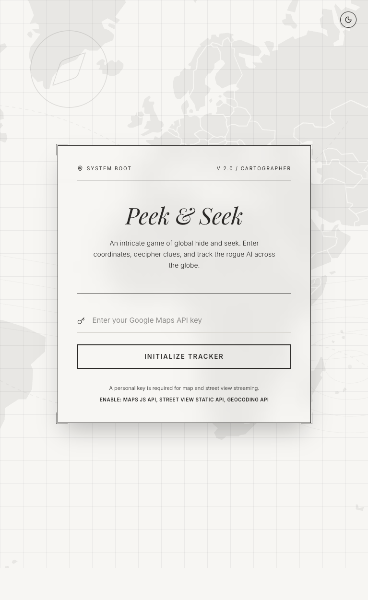
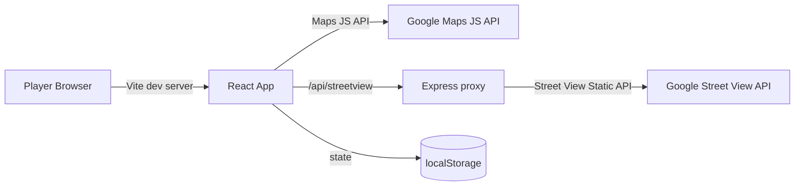

# Peek & Seek

Peek & Seek is a premium hide-and-seek game built around Google Maps, Street View, and directional clueing. The player starts from a styled landing screen, enters a Google Maps API key, chooses a difficulty, and then tries to locate a hidden coordinate on the map within a limited number of guesses.

## What The App Does

- Presents a cinematic landing screen with theme switching and difficulty selection.
- Loads an interactive Google Map with custom cartography-inspired styling.
- Requests Street View imagery from a lightweight Express proxy route.
- Gives distance and direction feedback after every guess.
- Persists game state and the player's API key in localStorage.
- Supports sharing a hidden target through URL parameters.

## Gameplay Loop

1. Enter a valid Google Maps API key.
2. Pick a difficulty level.
3. Pan the map to move the active probe.
4. Read the clue, review the Street View feed, and place waypoints if needed.
5. Plot coordinates to submit a guess.
6. Find the target before running out of attempts.

## Usage Screenshot



## Architecture Diagram



## Tech Stack

- React 19
- Vite
- TypeScript
- Tailwind CSS 4
- Motion
- Lucide React
- @vis.gl/react-google-maps
- Express for the local Street View proxy

## Requirements

- Node.js 18 or newer
- A Google Maps API key with the required Maps and Street View services enabled

## Google Cloud Setup

If the map shows `AuthFailure` or `ApiNotActivatedMapError`, the key is present but the Google Cloud project is not fully configured yet.

- Enable `Maps JavaScript API` in the Google Cloud project.
- Enable `Street View Static API` and `Geocoding API` for the visual feed and clue generation.
- Make sure billing is active on the project.
- Add a local referrer allowance for development, such as `http://localhost:3000/*`.
- If you use API restrictions, allow all three APIs above for the key.

## Setup

```bash
npm install
```

Create a local `.env` file:

```bash
VITE_GOOGLE_MAPS_API_KEY=your_api_key_here
```

Start the app in development mode:

```bash
npm run dev
```

Build for production:

```bash
npm run build
```

Preview a production build locally:

```bash
npm run preview
```

## Scripts

- `npm run dev` starts the Express + Vite development server on port `3000`.
- `npm run build` generates the production bundle.
- `npm run preview` serves the built app through the production server.
- `npm run start` builds and then launches the production server.
- `npm run lint` runs the TypeScript compiler with `--noEmit`.
- `npm run clean` removes the `dist` folder.

## Environment Variables

- `VITE_GOOGLE_MAPS_API_KEY`: Used by the client-side Google Maps integration.
- `GEMINI_API_KEY`: Defined in `vite.config.ts` for compatibility with AI-oriented tooling, but not currently used by the gameplay loop.

## Project Structure

- `src/App.tsx`: Top-level view switch between the landing page and the map game.
- `src/components/LandingPage.tsx`: Landing screen, key entry, and difficulty selection.
- `src/components/MapSection.tsx`: Core game board, sidebar, timers, clues, and guesses.
- `src/components/Footer.tsx`: Attribution and social links.
- `src/lib/sounds.ts`: Small Web Audio sound effects for click, success, and failure feedback.
- `src/lib/utils.ts`: Shared utility helpers.
- `server.ts`: Development server plus `/api/streetview` proxy endpoint.
- `src/index.css`: Global theme tokens and utility classes.

## Notes

- Game progress is persisted in localStorage so the session can survive reloads.
- The Street View proxy keeps the browser code simple and avoids directly handling image responses in the client.
- If the map is opened without a valid key, the app now shows a dedicated fallback screen instead of failing silently.

## License

This repository includes Apache-2.0 license headers in source files.
